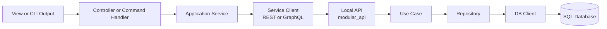
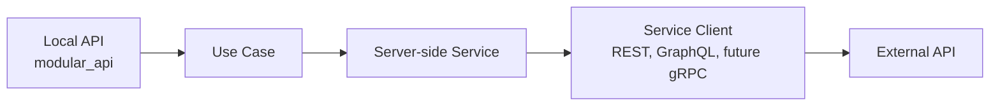
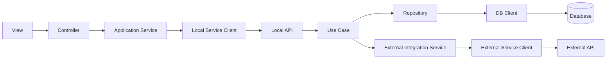

# Application Boundary Architecture Specification

**Status:** Proposed
**Date:** 2026-06-05
**Applies to:** Applications, CLIs, and backends built with `modular_api`, `service_client`, and `db_client` families

---

## 1. Purpose

This document defines the coherent MACSS architecture around three boundary
families:

- `modular_api` for the local API boundary
- `service_client` for outbound service consumption
- `db_client` for database integration

Its purpose is to make the layer separation explicit so application code does
not collapse into direct HTTP calls, direct driver calls, or confused
controller/service/repository responsibilities.

This document complements, but does not replace:

- [architecture.md](architecture.md)
- [service_client_model_spec.md](service_client_model_spec.md)
- [db_client_model_spec.md](db_client_model_spec.md)
- [twelve_package_development_spec.md](twelve_package_development_spec.md)

---

## 2. Core Idea

The architectural rule is simple:

- a consumer talks to an API through `service_client`
- the API talks to the database through `repository` plus `db_client`
- the API talks to external services through domain services backed by
  `service_client`

This means the local API is treated as a first-class boundary even when the
consumer belongs to the same product, monorepo, or deployment family.

---

## 3. Layer Vocabulary

### 3.1 View

The user-facing edge.

Examples:

- web page
- mobile screen
- terminal output
- CLI prompt
- scheduler or automation trigger

### 3.2 Controller

The application-side orchestration edge that reacts to the view or trigger.

Examples:

- MVC controller in a frontend or client app
- CLI command handler
- background job handler
- desktop or mobile action handler

In this document, `Controller` belongs to the consumer side, not to the server
core.

### 3.3 Application service

A domain-oriented facade used by the controller.

Examples:

- `CustomerService`
- `BillingService`
- `InventoryService`

This layer owns remote intent and DTO mapping for the caller. It should depend
on `service_client`, not on raw transport libraries.

It exists on the consumer side. It is not the same thing as a server `UseCase`
or a server-side integration service.

### 3.4 Local API

The HTTP or GraphQL boundary hosted by `modular_api`.

This is the transport edge of the server.

### 3.5 Use case

The business-operation entry point on the server.

This layer owns application behavior, orchestration, validation, and domain
flow.

A `UseCase` is the server business entry. It is not a consumer-side
application service.

### 3.6 Repository

The persistence boundary used by a use case.

This layer depends on `db_client`, not on raw drivers.

### 3.7 Database client

The engine integration boundary implemented by `db_client` packages.

This layer owns connections, sessions, execution, transactions, normalized
failures, and engine-specific helpers.

### 3.8 Server-side service

A domain service used by the server to call an external API.

This layer depends on `service_client`, not on raw HTTP code.

It exists only for outbound integrations from the server. It is not the same
thing as the consumer-side application service.

---

## 4. Canonical Flows

## 4.1 Local app or CLI consuming the local API



This is the canonical path for local product boundaries.

The key rule is that the consumer side does **not** bypass the API by importing
server use cases or repositories directly.

## 4.2 Local API calling an external API



The use case does not own raw transport code.

The server-side service encapsulates the remote intent and uses a
`service_client` package underneath.

## 4.3 Complete end-to-end picture



This is the target MACSS shape for apps, CLIs, and backends.

---

## 5. Clarification About "Controller"

Inside a server built with `modular_api`, there is no separate controller layer.

The server-side transport boundary is:

- API transport handled by `modular_api`
- business entry handled by `UseCase`

So the server-side path is:

- `API -> UseCase`

not:

- `API -> Controller -> Service -> ...`

The `Controller` term is reserved here for the **consumer side** of the local
API boundary.

---

## 6. Dependency Rules By Layer

### 6.1 Consumer side

Allowed:

- `View -> Controller`
- `Controller -> Application Service`
- `Application Service -> service_client`

Rejected:

- `View -> service_client`
- `View -> repository`
- `Controller -> db_client`
- `Controller -> raw HTTP library`

### 6.2 Server side

Allowed:

- `Local API -> UseCase`
- `UseCase -> Repository`
- `Repository -> db_client`
- `UseCase -> Server-side Service`
- `Server-side Service -> service_client`

Rejected:

- `UseCase -> raw driver`
- `UseCase -> raw HTTP library`
- `Repository -> raw driver`
- `Repository -> external API`
- `service_client -> db_client`
- `db_client -> service_client`

---

## 7. Public API Family Coherence

The public shape of `service_client` and `db_client` should feel intentionally
related.

They do not need identical names for every type, but they must expose the same
engineering grammar.

| Concern | `service_client` family | `db_client` family | Shared rule |
| --- | --- | --- | --- |
| Config object | `ServiceClientConfig` | `DbConnectionSettings` | explicit config, never hidden globals |
| Operation object | `ServiceOperation` | `DbCommand` | explicit operation descriptor |
| Result container | `ServiceResult<T>` | `DbResult<T>` | tagged success/failure result |
| Failure object | `ServiceFailure` | `DbFailure` | normalized failure model |
| Long-lived facade | `ServiceClient` | `DbClient` or engine root facade | reusable lifecycle |
| One-shot helper | `httpClient()` / `graphqlClient()` | execution shortcut or helper | sugar must preserve semantics |
| Lifecycle | `close()` | `close()` / `release()` | ownership must be explicit |

This rule is what keeps the ecosystem coherent for application developers.

---

## 8. Standardized Output Semantics

Both boundary families must present standardized output semantics.

### 8.1 Required semantic slots

Every normalized boundary outcome must make available:

- success or failure
- payload or value on success
- structured failure on error
- metadata for observability and advanced use

### 8.2 Recommended semantic shape

The exact SDK syntax may differ, but the semantic shape should remain:

```text
Result<T>
├── ok / isSuccess
├── value / data
├── failure
└── metadata on the outer result or on the normalized success payload
```

`service_client` and `db_client` should align to this structure even when their
success payloads differ.

In practice:

- `service_client` usually carries metadata in `ServiceResponse<T>`
- `db_client` usually carries metadata in `DbRowSet`,
  `DbExecutionSummary`, or `DbScalar`

### 8.3 Why this matters

This consistency lets application services, controllers, use cases, and
repositories adopt one mental model for handling remote and persistence results.

---

## 9. Engineering Rules

### 9.1 No raw transport leakage

- no raw HTTP client in controllers
- no raw HTTP client in use cases
- no raw driver in use cases
- no raw driver in repositories

### 9.2 No hidden lifecycle ownership

- clients must not silently create a second hidden transport when one was
  supplied
- db clients must not silently create a second hidden session or pool when one
  was supplied

### 9.3 No boundary skipping

- local consumers should call the local API through `service_client`
- use cases should call the persistence boundary through repositories and
  `db_client`
- use cases should call external APIs through server-side services backed by
  `service_client`

### 9.4 Observability by default

Both client families should support:

- correlation IDs
- timeouts
- redacted diagnostics
- logging hooks
- metrics or tracing hooks where possible

### 9.5 Testability by design

Both client families must be easy to fake in tests.

That means:

- operation descriptors are explicit objects
- failures are normalized values
- the main facade can be mocked, faked, or stubbed

---

## 10. Package Implications

This architecture maps directly to the package family described in
[twelve_package_development_spec.md](twelve_package_development_spec.md).

The relevant package responsibilities are:

- `modular_api` = local API boundary
- `modular_api_rest_client` = outbound REST client boundary
- `modular_api_graphql_client` = outbound GraphQL client boundary
- `modular_api_sqlserver` = SQL Server persistence boundary
- `modular_api_postgres` = Postgres persistence boundary

Future extension:

- `modular_api_grpc_client` may be added later without changing the layer map

---

## 11. Immediate Architecture Decisions

The following decisions are now explicit.

- A local API is a real architectural boundary, not an implementation detail.
- Consumer-side orchestration belongs in controllers and application services,
  not in raw transport calls.
- Server-side orchestration belongs in use cases.
- Repositories own persistence intent and depend on `db_client`.
- Server-side external integration services own remote intent and depend on
  `service_client`.
- `service_client` and `db_client` must look like one coherent engineering
  family.

These decisions should be treated as the default MACSS architecture unless a
future ADR explicitly changes them.