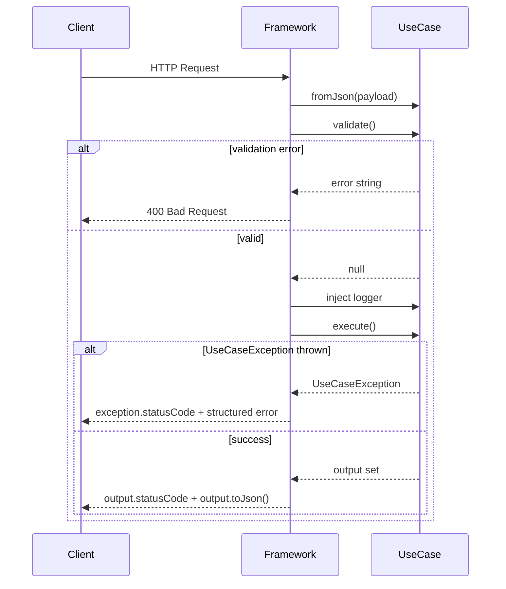
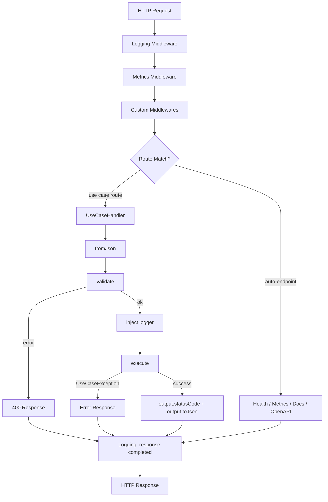
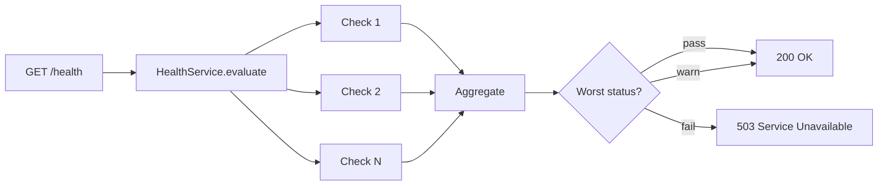
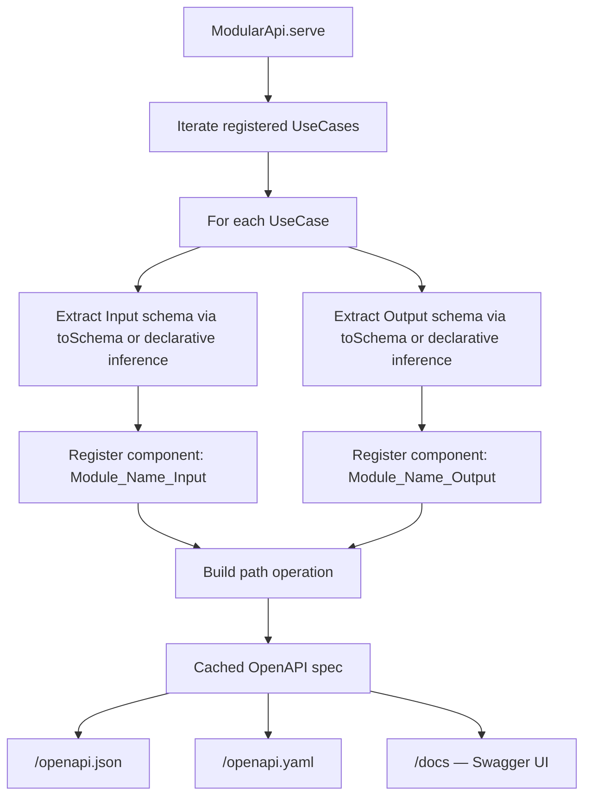
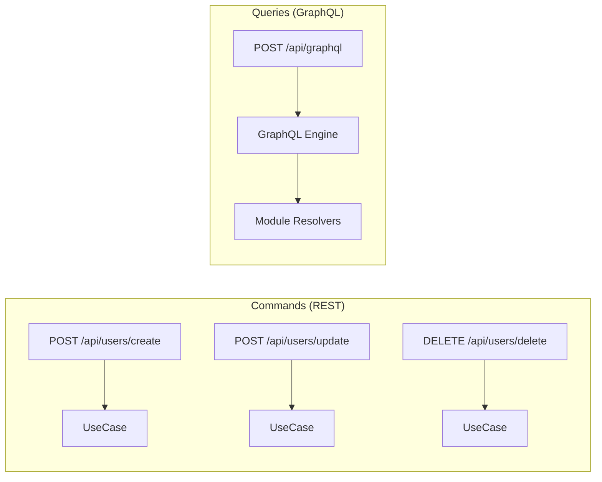
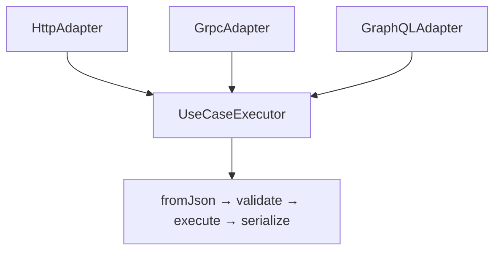

# Modular API — Architecture Specification

**Status:** Living Document  
**Version:** 0.4.0  
**Applies to:** All implementations (Dart, TypeScript, Python, future languages)  
**Last updated:** 2026-03-11

---

## 1. Abstract

Modular API is a **language-agnostic specification** for building use-case-centric
HTTP APIs. It defines a minimal set of contracts, conventions, and subsystems that
any conforming implementation must provide — regardless of the programming language
or HTTP framework underneath.

The specification is deliberately opinionated: every API endpoint maps to exactly
one use case. Cross-cutting concerns (logging, metrics, health checks) are built-in
and follow established standards. The developer's only responsibility is to define
business logic inside use cases and their DTOs.

This document is the **canonical reference**. Language-specific packages implement
this specification by adapting the contracts to their native HTTP framework.

---

## 2. Notation and Conventions

- **MUST**, **MUST NOT**, **SHOULD**, **SHOULD NOT**, **MAY** follow
  [RFC 2119](https://datatracker.ietf.org/doc/html/rfc2119) semantics.
- Code examples use pseudocode unless tied to a specific language binding.
- Diagrams use [Mermaid](https://mermaid.js.org/) syntax.

---

## 3. Design Principles

| Principle | Statement |
|---|---|
| **One endpoint, one use case** | Every route maps to a single `UseCase` instance. No controller classes, no catch-all handlers. |
| **Contracts, not inheritance** | `UseCase`, `Input`, and `Output` are pure abstract contracts. Implementations use `implements`, never `extends`. |
| **Convention over configuration** | Routing, serialization, error handling, and documentation are derived from the contracts automatically. |
| **Standards over invention** | Every subsystem adopts an established standard (RFC, IETF draft, Prometheus, OpenAPI). |
| **Zero dependencies when possible** | Prefer native implementations over third-party libraries. External dependencies are justified only when reimplementation is unreasonably costly. |
| **Opt-in subsystems** | Built-in capabilities (metrics, GraphQL) ship with the package but require explicit activation. |

---

## 4. Core Contracts

### 4.1 UseCase\<I, O\>

The central abstraction. A use case encapsulates a single business operation
with a well-defined lifecycle managed entirely by the framework.

```
UseCase<I extends Input, O extends Output>
├── input: I                          // Read-only DTO, set at construction
├── output: O                         // Write DTO, set during execute()
├── logger?: ModularLogger            // Injected by the framework
├── fromJson(json) → UseCase          // Static factory (construction)
├── validate() → string | null        // Pre-execution validation
├── execute() → Future<void>          // Business logic
└── toJson() → Map                    // Serialization of output
```

**Lifecycle:**



**Rules:**

- A use case MUST implement all members explicitly. No behavior is inherited.
- `fromJson` MUST be a static factory. The framework calls it to construct
  the use case from the deserialized HTTP payload.
- `validate()` MUST return a single error string or `null`. The framework
  returns 400 if non-null.
- `execute()` MUST set `this.output` before returning. The framework reads
  `output.toJson()` and `output.statusCode` to build the HTTP response.
- `logger` is injected by the framework before `execute()` is called.
  Use cases SHOULD use `logger?.info(...)` for structured, request-scoped logging.

### 4.2 Input

A pure data transfer object representing the inbound payload.

```
Input
├── fromJson(json) → Input            // Deserialization
├── toJson() → Map                    // Serialization
└── toSchema() → Map                  // OpenAPI JSON Schema (see §4.4)
```

**Rules:**

- An Input MUST be constructible from a plain JSON map.
- An Input MUST expose its OpenAPI schema via `toSchema()` or via automatic
  schema generation (see §4.4).

### 4.3 Output

A pure data transfer object representing the outbound response.

```
Output
├── toJson() → Map                    // Serialization
├── toSchema() → Map                  // OpenAPI JSON Schema (see §4.4)
└── statusCode: int                   // HTTP status code
```

**Rules:**

- An Output MUST declare `statusCode` explicitly. This forces the developer
  to consciously decide the HTTP status code for every successful response.
- Common status codes: `200` (OK), `201` (Created), `204` (No Content).

### 4.4 Schema Generation

Implementations MUST support automatic OpenAPI JSON Schema generation from
the DTO definition itself. The `toSchema()` method MAY still be implemented
manually, but the preferred approach is **declarative schema inference**
using the language's native type system.

| Language | Mechanism | Example |
|---|---|---|
| Python | Pydantic `BaseModel` | `class HelloInput(BaseModel): name: str` |
| Dart | `@MacssSchema()` macro | `@MacssSchema() class HelloInput implements Input { ... }` |
| TypeScript | TypeBox `Type.Object()` | `const HelloInputSchema = Type.Object({ name: Type.String() })` |

**Rules:**

- Implementations MUST generate a valid JSON Schema (draft 2020-12 or
  compatible subset) from the DTO definition.
- If a DTO provides both a declarative schema and a manual `toSchema()`,
  the declarative schema takes precedence.
- The generated schema MUST be compatible with OpenAPI 3.0 `$ref` resolution.

### 4.5 UseCaseException

A controlled exception thrown during `execute()` to produce a non-2xx HTTP
response with a structured error body.

```
UseCaseException
├── statusCode: int                   // HTTP status code (400, 404, 422, 500…)
├── message: string                   // Human-readable error description
├── errorCode?: string                // Machine-readable error code
├── details?: Map                     // Additional context (validation errors, etc.)
└── toJson() → Map                    // Serialization
```

**Current error response format:**

```json
{
  "error": "RESOURCE_NOT_FOUND",
  "message": "User with ID 42 not found",
  "details": { "id": 42 }
}
```

> **Future direction — RFC 7807 adoption:**
> A future version will migrate to
> [RFC 7807 — Problem Details for HTTP APIs](https://datatracker.ietf.org/doc/html/rfc7807)
> with `Content-Type: application/problem+json`. The standardized body will be:
>
> ```json
> {
>   "type": "https://api.example.com/problems/not-found",
>   "title": "Resource not found",
>   "status": 404,
>   "detail": "User with ID 42 not found",
>   "instance": "/api/users/find"
> }
> ```
>
> This applies to **all** error responses — both domain exceptions
> (`UseCaseException`) and system errors (validation failures, unhandled
> exceptions). See §12 for the full adoption plan.

**Rules:**

- Throwing `UseCaseException` inside `execute()` MUST produce an HTTP
  response with the specified `statusCode` and the serialized error body.
- Unhandled exceptions MUST produce a `500 Internal Server Error` with a
  generic message. Stack traces MUST NOT be exposed to the client.
- Validation errors (from `validate()`) MUST produce `400 Bad Request`.

---

## 5. Module System

### 5.1 ModuleBuilder

A fluent builder that groups related use cases under a named module.
Each module produces a set of routes under `/{basePath}/{moduleName}/`.

```
ModuleBuilder
├── usecase(name, factory, options?) → this
└── (internal) mount() → void
```

**Registration:**

```
api.module('greetings', (m) => {
    m.usecase('hello', HelloWorld.fromJson);
    m.usecase('goodbye', Goodbye.fromJson, { method: 'DELETE' });
});
```

**Route generation:**

| Registration | Generated route |
|---|---|
| `m.usecase('hello', factory)` | `POST /api/greetings/hello` |
| `m.usecase('hello', factory, { method: 'GET' })` | `GET /api/greetings/hello` |

**Rules:**

- The default HTTP method MUST be `POST`.
- The module name and use case name MUST be URL-safe strings.
- Leading slashes in use case names MUST be stripped silently.

### 5.2 ModularApi (Orchestrator)

The top-level class that composes modules, middleware, health checks, and
auto-mounted endpoints into a running HTTP server.

```
ModularApi
├── module(name, build) → this         // Register a module
├── use(middleware) → this             // Add custom middleware
├── addHealthCheck(check) → this       // Register a health check
├── metrics → MetricsRegistrar?        // Public metric registration (null if disabled)
└── serve(options) → Server            // Start the HTTP server
```

**Configuration:**

| Option | Default | Description |
|---|---|---|
| `basePath` | `/api` | URL prefix for all use case routes |
| `title` | `Modular API` | API title (Swagger, health response) |
| `version` | `x.y.z` | API version |
| `releaseId` | `{version}-debug` | Release identifier for health response |
| `metricsEnabled` | `false` | Enable Prometheus metrics subsystem |
| `metricsPath` | `/metrics` | Metrics endpoint path |
| `logLevel` | `info` | Minimum RFC 5424 severity to emit |

**Auto-mounted endpoints:**

| Endpoint | Description | Content-Type |
|---|---|---|
| `GET /health` | IETF health check response | `application/health+json` |
| `GET /docs` | Swagger UI | `text/html` |
| `GET /openapi.json` | OpenAPI 3.0 specification | `application/json` |
| `GET /openapi.yaml` | OpenAPI 3.0 specification | `application/x-yaml` |
| `GET /metrics` | Prometheus metrics (if enabled) | `text/plain; version=0.0.4` |

---

## 6. Request Processing Pipeline

The middleware pipeline has a **fixed order** for framework-provided layers.
Custom middleware is inserted between the framework layers and the route handler.



### 6.1 Logging Middleware (outermost)

Wraps the entire request lifecycle. Always the first middleware in the pipeline.

**Behavior:**

1. Read `X-Request-ID` header. If absent, generate a UUID v4.
2. Create a `RequestScopedLogger` with the trace ID.
3. Emit `"request received"` at `info` level.
4. Propagate the logger via framework-specific context mechanism.
5. Execute the inner handler and measure elapsed time.
6. Emit `"request completed"` with status code and duration.
7. Attach `X-Request-ID` to the response.
8. On unhandled exception: emit `"unhandled exception"` at `error` level.

**Excluded routes:** `/health`, `/metrics`, `/docs` — pass through silently.

### 6.2 Metrics Middleware

Records HTTP request telemetry. Only active when `metricsEnabled` is `true`.

**Behavior:**

1. Increment `http_requests_in_flight` gauge.
2. Execute the inner handler and measure elapsed time.
3. Decrement `http_requests_in_flight` gauge.
4. Increment `http_requests_total` counter with labels: `method`, `route`, `status_code`.
5. Observe `http_request_duration_seconds` histogram with the same labels.

**Route normalization:** If the request path matches a registered use case route,
use that path as the `route` label. Otherwise, use `"UNMATCHED"` to prevent
high-cardinality label explosion.

**Excluded routes:** Same as logging middleware.

### 6.3 UseCaseHandler (Transport Adapter)

The handler converts an HTTP request into a use case lifecycle invocation.
It is the bridge between the transport layer and the business logic.

**Payload extraction:**

| HTTP Method | Payload source |
|---|---|
| `GET`, `DELETE` | Query parameters + path parameters |
| `POST`, `PUT`, `PATCH` | Request body (JSON) |

> **Future direction — Transport Adapters:**
> The current handler is HTTP-specific. A future version will introduce a
> generic `UseCaseExecutor` that owns the lifecycle
> (`fromJson → validate → execute → serialize`), with thin transport adapters
> (`HttpAdapter`, `GrpcAdapter`, etc.) that only handle payload extraction
> and response writing. This eliminates lifecycle duplication across transports.

---

## 7. Structured Logging

**Standard:** [RFC 5424 — The Syslog Protocol](https://datatracker.ietf.org/doc/html/rfc5424)

### 7.1 Log Levels

| Value | Level | Usage |
|---|---|---|
| 0 | `emergency` | System is unusable |
| 1 | `alert` | Immediate action required |
| 2 | `critical` | Critical conditions |
| 3 | `error` | Error conditions |
| 4 | `warning` | Warning conditions |
| 5 | `notice` | Normal but significant |
| 6 | `info` | Informational |
| 7 | `debug` | Debug-level messages |

**Filtering rule:** A message is emitted only if `message.level.value <= configuredLevel.value`.
Setting `logLevel: info` (6) emits levels 0–6 and suppresses `debug` (7).

### 7.2 ModularLogger Interface

The public API exposed to use cases. Eight methods, one per RFC 5424 level:

```
ModularLogger
├── traceId: string                    // Request-scoped correlation ID
├── emergency(msg, fields?) → void
├── alert(msg, fields?) → void
├── critical(msg, fields?) → void
├── error(msg, fields?) → void
├── warning(msg, fields?) → void
├── notice(msg, fields?) → void
├── info(msg, fields?) → void
└── debug(msg, fields?) → void
```

Each method accepts an optional `fields` map for structured data.

### 7.3 Log Output Format

JSON, one line per log entry. Compatible with Loki, Grafana, CloudWatch, and
any JSON-aware log aggregator.

```json
{
  "ts": 1741654800.123,
  "level": "info",
  "severity": 6,
  "msg": "request received",
  "service": "My API",
  "trace_id": "550e8400-e29b-41d4-a716-446655440000",
  "method": "POST",
  "route": "/api/greetings/hello",
  "fields": {}
}
```

### 7.4 HTTP Status to Log Level Mapping

| Status range | Log level |
|---|---|
| 500+ | `error` (3) |
| 400–499 | `warning` (4) |
| 200–399 | `info` (6) |
| 100–199 | `notice` (5) |

### 7.5 UUID v4 Generation

Implementations MUST generate RFC 4122-compliant UUID v4 values for trace IDs
when the `X-Request-ID` header is absent. The implementation MUST use a
cryptographically secure random source.

**Standard:** [RFC 4122 — UUID URN Namespace](https://datatracker.ietf.org/doc/html/rfc4122)

---

## 8. Health Checks

**Standard:** [IETF Health Check Response Format for HTTP APIs (draft-inadarei-api-health-check)](https://datatracker.ietf.org/doc/html/draft-inadarei-api-health-check-06)

### 8.1 HealthCheck Contract

```
HealthCheck
├── name: string                       // Display name (map key in response)
├── timeout: Duration                  // Per-check timeout (default: 5 seconds)
└── check() → Future<HealthCheckResult>
```

### 8.2 HealthCheckResult

```
HealthCheckResult
├── status: HealthStatus               // pass | warn | fail
├── responseTime?: int                 // Milliseconds (populated by framework)
├── output?: string                    // Optional human-readable detail
└── toJson() → Map
```

### 8.3 Health Evaluation



**Rules:**

- All registered checks MUST execute **in parallel**.
- Each check MUST enforce its own `timeout`. A timed-out check MUST report `fail`.
- An exception during a check MUST report `fail` with the error message as `output`.
- Aggregation uses **worst-status-wins**: `fail` > `warn` > `pass`.
- HTTP status: `200` for `pass` or `warn`, `503` for `fail`.
- Content-Type: `application/health+json`.

### 8.4 Response Format

```json
{
  "status": "pass",
  "version": "1.0.0",
  "releaseId": "1.0.0-abc123",
  "checks": {
    "database": {
      "status": "pass",
      "responseTime": 12,
      "output": "Connection pool healthy"
    },
    "redis": {
      "status": "warn",
      "responseTime": 250,
      "output": "High latency detected"
    }
  }
}
```

---

## 9. Prometheus Metrics

**Standard:** [Prometheus Exposition Format (version 0.0.4)](https://prometheus.io/docs/instrumenting/exposition_formats/)

### 9.1 Metric Types

| Type | Behavior | Example |
|---|---|---|
| **Counter** | Monotonically increasing | `http_requests_total` |
| **Gauge** | Can increase or decrease | `http_requests_in_flight` |
| **Histogram** | Observations in pre-defined buckets | `http_request_duration_seconds` |

### 9.2 Built-in HTTP Metrics

These three metrics are created automatically when `metricsEnabled` is `true`:

| Metric | Type | Labels | Help |
|---|---|---|---|
| `http_requests_total` | Counter | `method`, `route`, `status_code` | Total number of HTTP requests |
| `http_requests_in_flight` | Gauge | — | Requests currently being processed |
| `http_request_duration_seconds` | Histogram | `method`, `route`, `status_code` | Request duration in seconds |

**Default histogram buckets:** `[0.005, 0.01, 0.025, 0.05, 0.1, 0.25, 0.5, 1.0, 2.5, 5.0, 10.0]`

### 9.3 MetricRegistry (Internal)

- Stores all metrics in insertion order.
- Auto-registers `process_start_time_seconds` gauge on initialization.
- Name validation: `^[a-zA-Z_:][a-zA-Z0-9_:]*$`
- Serialization outputs Prometheus text exposition format with `# HELP` and `# TYPE` lines.

### 9.4 MetricsRegistrar (Public API)

Exposed via `api.metrics` for custom metric registration by users.

- Validates that user metric names do not start with `__` (reserved for internal use).
- Delegates creation to the internal `MetricRegistry`.

```
api.metrics?.createCounter({ name: 'greetings_total', help: 'Total greetings served' });
api.metrics?.createGauge({ name: 'active_sessions', help: 'Current active sessions' });
api.metrics?.createHistogram({ name: 'query_duration_seconds', help: 'DB query duration' });
```

### 9.5 Exposition Endpoint

`GET /metrics` returns `text/plain; version=0.0.4; charset=utf-8`:

```
# HELP http_requests_total Total number of HTTP requests.
# TYPE http_requests_total counter
http_requests_total{method="POST",route="/api/greetings/hello",status_code="200"} 42
# HELP http_requests_in_flight Number of HTTP requests currently being processed.
# TYPE http_requests_in_flight gauge
http_requests_in_flight 0
```

---

## 10. OpenAPI Specification Generation

**Standard:** [OpenAPI Specification 3.0.3](https://spec.openapis.org/oas/v3.0.3)

### 10.1 Generation Process



### 10.2 Path Operation Mapping

| HTTP Method | Request handling | Response |
|---|---|---|
| `GET`, `DELETE` | Input schema properties → query parameters | Output schema as body |
| `POST`, `PUT`, `PATCH` | Input schema → `requestBody` (JSON) | Output schema as body |

### 10.3 Standard Responses

Every operation MUST include at minimum:

| Status | Description | When |
|---|---|---|
| `2xx` | Success response per `output.statusCode` | `execute()` completes normally |
| `400` | Bad Request | `validate()` returns an error |
| `500` | Internal Server Error | Unhandled exception |

### 10.4 Component Naming

Schemas are registered as OpenAPI components using the pattern:
`{ModuleName}_{UseCaseName}_Input` and `{ModuleName}_{UseCaseName}_Output`.

### 10.5 JSON to YAML Conversion

Implementations MUST include a **zero-dependency** JSON-to-YAML converter for
the `/openapi.yaml` endpoint. YAML reserved words and special characters MUST
be properly quoted.

---

## 11. Routing and Future QCSR Architecture

### 11.1 Current: RESTful Routing

All use case endpoints follow the pattern:

```
{METHOD} /{basePath}/{moduleName}/{useCaseName}
```

Full REST method support: `GET`, `POST`, `PUT`, `PATCH`, `DELETE`.
Default method is `POST`.

### 11.2 Future: QCSR (Query–Command Separation Responsibilities)

> **Planned for a future version.**

The architecture will evolve toward a clear separation between reads and writes:



**Key decisions:**

- **Commands** (writes) remain as REST use case endpoints.
- **Queries** (reads) move to a single GraphQL endpoint at `/{basePath}/graphql`.
- GraphQL is an **internal plugin**: ships with the package but requires explicit
  activation (similar to `metricsEnabled`).
- Schema is SDL-first: defined in `.graphql` files per module.
- The framework performs automatic schema merging across modules.
- GraphQL mutations are **not supported** — all mutations go through REST use cases.
- Logging, metrics, and middleware are shared between REST and GraphQL.

---

## 12. Future Directions

### 12.1 RFC 7807 — Problem Details for HTTP APIs

**Standard:** [RFC 7807](https://datatracker.ietf.org/doc/html/rfc7807)

All error responses (validation, domain exceptions, system errors) will
adopt the `application/problem+json` content type with the standardized body:

```json
{
  "type": "https://api.example.com/problems/validation-failed",
  "title": "Validation Failed",
  "status": 400,
  "detail": "Field 'email' is required",
  "instance": "/api/users/create"
}
```

**Migration path:**

1. `UseCaseException` gains `type` and `title` fields.
2. Validation errors produce Problem Details with `type: .../validation-error`.
3. Unhandled exceptions produce Problem Details with `type: .../internal-error`.
4. All error responses set `Content-Type: application/problem+json`.
5. The `error` and `message` fields in the current format map to `title` and
   `detail` respectively. `errorCode` maps to a URI suffix in `type`.

### 12.2 Transport Adapters

Decouple the use case lifecycle from HTTP:



The `UseCaseExecutor` owns the canonical lifecycle. Transport adapters handle
only payload extraction and response writing.

### 12.3 RFC 6749 — OAuth 2.0 Authorization Framework

**Standard:** [RFC 6749](https://datatracker.ietf.org/doc/html/rfc6749)

Future built-in support for OAuth 2.0 Client Credentials flow as an
opt-in authentication middleware.

---

## 13. Implementation Matrix

### 13.1 Language Bindings

| Aspect | Dart | TypeScript | Python |
|---|---|---|---|
| **HTTP framework** | [shelf](https://pub.dev/packages/shelf) | [Express](https://expressjs.com/) | [Starlette](https://www.starlette.io/) |
| **Package** | `modular_api` (pub.dev) | `@macss/modular-api` (npm) | `modular-api` (PyPI) |
| **Version** | 0.4.0 | 0.4.0 | — |
| **Schema generation** | `@MacssSchema()` macro | TypeBox `Type.Object()` | Pydantic `BaseModel` |
| **Metrics** | Native implementation | Native implementation | Native implementation |
| **Swagger UI** | `shelf_swagger_ui` | `swagger-ui-express` | Native or `starlette-swagger-ui` |
| **YAML serializer** | Native (zero-dep) | Native (zero-dep) | Native (zero-dep) |
| **UUID v4** | Native (`Random.secure()`) | Native (`crypto.randomUUID()`) | Native (`uuid.uuid4()`) |

### 13.2 Contract Parity

All implementations MUST satisfy the same external behavior:

- Same HTTP response bodies for identical inputs.
- Same endpoint paths and auto-mounted routes.
- Same middleware pipeline order.
- Same health check response format.
- Same Prometheus exposition format.
- Same OpenAPI spec structure.
- Same structured log format.
- Same error response structure.

Internal architecture (class hierarchy, module layout, naming conventions) MAY
vary to follow each language's idioms, as long as the external contract is preserved.

---

## 14. Standards Reference

| Standard | Usage in Modular API | Section |
|---|---|---|
| [RFC 2119](https://datatracker.ietf.org/doc/html/rfc2119) | Requirement level keywords | §2 |
| [RFC 4122](https://datatracker.ietf.org/doc/html/rfc4122) | UUID v4 for trace IDs | §7.5 |
| [RFC 5424](https://datatracker.ietf.org/doc/html/rfc5424) | Syslog severity levels for structured logging | §7 |
| [RFC 6749](https://datatracker.ietf.org/doc/html/rfc6749) | OAuth 2.0 (future) | §12.3 |
| [RFC 7807](https://datatracker.ietf.org/doc/html/rfc7807) | Problem Details for HTTP APIs (future) | §12.1 |
| [OpenAPI 3.0.3](https://spec.openapis.org/oas/v3.0.3) | API specification generation | §10 |
| [IETF Health Check (draft-06)](https://datatracker.ietf.org/doc/html/draft-inadarei-api-health-check-06) | Health endpoint response format | §8 |
| [Prometheus Exposition Format 0.0.4](https://prometheus.io/docs/instrumenting/exposition_formats/) | Metrics endpoint format | §9 |
| [JSON Schema (draft 2020-12)](https://json-schema.org/specification) | DTO schema generation | §4.4 |
| [Semantic Versioning 2.0.0](https://semver.org/) | Package versioning | — |